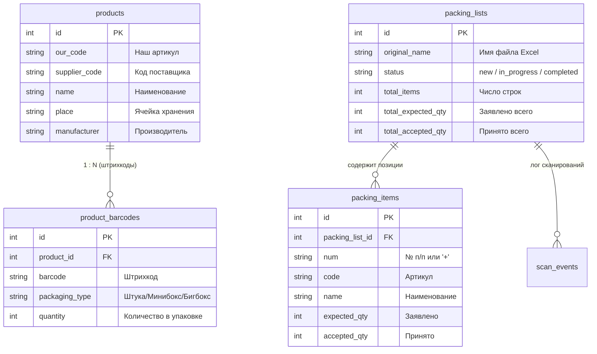

# 📦 Резюме модернизации проекта: Warehouse V2 (Portainer & SQLite)

Данный документ содержит полное описание архитектурных, функциональных и интерфейсных изменений при переработке складской системы приёмки и учёта штрихкодов.

---

## 1. Ключевые цели и результаты

| Критерий | Было (Старая версия) | Стало (Версия V2) |
| :--- | :--- | :--- |
| **Инфраструктура** | Жесткая привязка к Synology NAS (монтирование SMB/NFS папок) | Автономный Docker-контейнер, управляемый через **Portainer** |
| **База данных** | Псевдо-БД в виде Excel-файла `barcodeDB.xlsx` на сетевом диске | Высокопроизводительная **SQLite** в режиме WAL (`warehouse.db`) |
| **Штрихкоды** | Строго 1 ШК на штуку, 1 на минибокс, 1 на бигбокс | **Схема 1:N**: любое количество штрихкодов и упаковок с разными коэффициентами |
| **Упаковочные листы** | Ручное копирование файлов на сетевую папку Synology | Загрузка, приёмка, сброс и удаление файлов **прямо через Web-интерфейс** |
| **Надёжность связи** | При сбое Wi-Fi данные пиков терялись | **Offline-first Outbox**: очередь локального сохранения, 0% потери данных |
| **Эргономика ТСД** | Медленный сканер с камеры (QuaggaJS), всплытие экранной клавиатуры | Только лазерный сканер ТСД, подавление клавиатуры, моментальный отклик |
| **Ввод количества** | Кнопки `+` и `-` (медленно для больших партий) | Прямой ввод числа руками с автовыделением и подтверждением по `Enter` |

---

## 2. Архитектура и база данных (SQLite)

База данных переведена на SQLite с включённым режимом **WAL** (Write-Ahead Logging), что обеспечивает мгновенную запись без блокировок при одновременных запросах.



### Двусторонняя синхронизация с Excel:
* **📥 Скачать базу (.xlsx):** Выгрузка всей базы данных SQLite в красиво отформатированный Excel со всеми привязанными штрихкодами и фасовками.
* **📤 Залить Excel (Merge):** Умное объединение. Существующие связи не удаляются, новые позиции и штрихкоды дополняются.

---

## 3. Функционал приёмки и работа с листами

1. **Интеллектуальный парсинг Excel поставщиков:**
   * Автоматическое сканирование первых 20 строк для нахождения строки заголовков (`Код`, `Наименование`, `Количество`).
   * Корректная обработка файлов с метаданными (шапка накладной, дата, номер договора).
   * Исключение ложных строк-заголовков из приёмки.
2. **Защита от потери данных (Offline Outbox Queue):**
   * Все пики сканера сначала записываются в локальную очередь браузера (`localStorage`).
   * Фоновый синхронизатор пачками передаёт данные на сервер. Если сеть моргнула — ТСД продолжает работу, а после восстановления связи данные синхронизируются автоматически.
3. **Завершение приёмки:**
   * Проверка на расхождения: если принято меньше или больше заявленного, система запрашивает подтверждение.
   * При завершении приёмки лист получает статус **«✓ Принят»**, а файл перемещается в архив `archive/`.
   * Состояние очищается из хранилища браузера: при обновлении страницы (**F5**) приложение возвращается к списку листов, а не зависает в завершённом листе.
4. **Просмотр принятых листов:**
   * Просмотр архивного листа открывается в режиме *«Только чтение»*: кнопки приёмки скрыты, поля ввода заблокированы, сканирование блокируется уведомлением.
5. **Механизм «↺ Перепринять»:**
   * Возможность вернуть любой принятый лист в работу: счетчики обнуляются, файл возвращается из архива.
   * Все ошибочно отсканированные внеплановые позиции (`#+`, где заявлено 0) автоматически вычищаются, возвращая исходное количество строк.
6. **Работа с ошибочными/чужими товарами (`#+`):**
   * Если отсканирован товар не из накладной, он помечается значком `#+`.
   * Удалить его можно двумя быстрыми способами: нажатием на кнопку **`🗑`** прямо в карточке или установкой количества в **`0`**.
7. **Акт расхождений Excel:**
   * Генерация официального отчёта в Excel с цветовой маркировкой расхождений (недовозы — красным, излишки — жёлтым, принятые полностью — зелёным).

---

## 4. Оптимизация под ТСД и мобильные устройства

1. **Отказ от камеры (QuaggaJS):**
   * Удалена тяжёлая библиотека сканирования с камеры, создававшая нагрузку на процессор и задержки интерфейса.
2. **Блокировка экранной клавиатуры (`⌨️ ТСД (Блок)`):**
   * При активном режиме аппаратного сканера для полей ввода выставляется `inputmode="none"`. Виртуальная клавиатура Android не всплывает и не заслоняет карточки товаров.
3. **Прямой ввод количества:**
   * Вместо мелких кнопок `+` и `-` установлено прямое числовое поле. При нажатии на него число автоматически выделяется — достаточно набрать новую цифру и нажать `Enter`.
4. **Вкладка «Место» (поиск ячеек):**
   * Убран промежуточный поиск по буквам.
   * Поиск запускается только по нажатию **`Enter`** (для ручного ввода кода) или автоматически при считывании штрихкода лазерным сканером (поддерживаются стандартный `Enter` и суффикс `+ET`).
   * Добавлена кнопка **«Найти»** для удобства работы с сенсорных экранов.
5. **Фиксация нижней навигации на смартфонах:**
   * Панель вкладок переведена на `position: fixed; bottom: 0;` с поддержкой `100dvh` и системных зон безопасного отступа `env(safe-area-inset-bottom)`. Панель больше не срезается адресной строкой мобильного браузера Chrome.

---

## 5. Структура репозитория и деплой

Все файлы проекта собраны в чистую автономную папку **`warehouse-portainer/`**, готовую к выгрузке на GitHub.

### Содержимое репозитория (всего 15 файлов):
```text
warehouse-portainer/
├── .dockerignore
├── .gitignore
├── docker-compose.yml          # Конфигурация стека для Portainer
├── Dockerfile                  # Сборка PHP 8.2 + Apache + SQLite + GD + Zip
├── README.md                   # Руководство по развертыванию и эксплуатации
└── src/
    ├── composer.json           # Описание зависимостей
    ├── composer.lock
    ├── db.php                  # Подключение к SQLite (WAL mode, авто-миграции)
    ├── index.html              # Одностраничное приложение (SPA) для ТСД
    ├── vendor.tar.gz           # Предсобранные зависимости PhpSpreadsheet (1.2 МБ)
    └── api/
        ├── barcodes.php        # API списка штрихкодов и производителей
        ├── import_export.php   # API импорта и экспорта Excel-базы
        ├── packing_lists.php   # API управления упаковочными листами и актами
        ├── packing_state.php   # API приёма и синхронизации очереди Outbox
        └── search.php          # API быстрого поиска мест хранения ячеек
```

> [!NOTE]
> Зависимости PhpSpreadsheet упакованы в компактный архив `vendor.tar.gz` (1.2 МБ). Это позволило сократить количество файлов с 1100 до 15 (для комфортной загрузки через веб-интерфейс GitHub) и гарантирует 100% надёжную сборку контейнера в Portainer без обращений к внешним репозиториям Packagist.

---

## 6. Параллельный запуск на сервере

Для исключения конфликтов с уже работающей старой системой `warehouse-acceptance` на сервере:
* **Имя сервиса и контейнера:** `warehouse-v2`
* **Внешний порт:** `8070` (старая система остаётся на `8090`)
* **Изолированный том данных:** `warehouse_storage_v2`
* **Файл базы данных внутри тома:** `/var/warehouse_data/warehouse.db`
